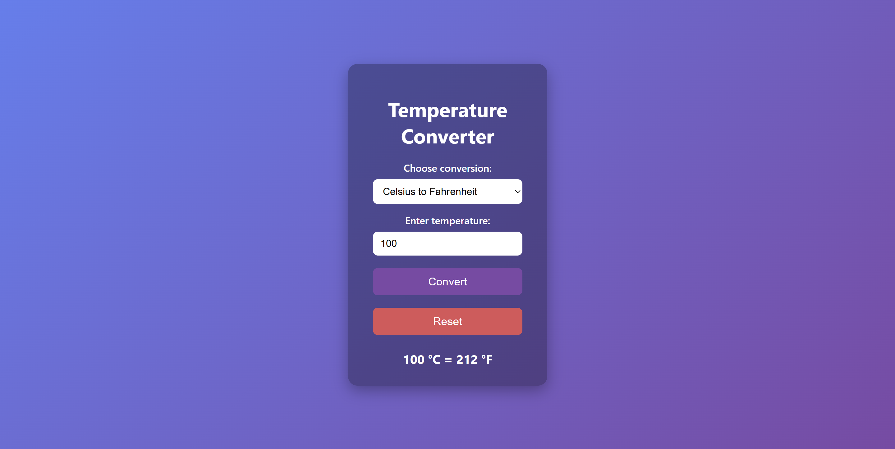

# Temperature Converter 🔥❄️

A simple and responsive web app that converts temperatures between Celsius, Fahrenheit, and Kelvin using HTML, CSS, and modern JavaScript (ES6+).

## 🛠️ Built With

- HTML
- CSS
- JavaScript (ES6+)

## 📸 Screenshot

## 🔗 Live Demo

[Click here to use the Temperature Converter](https://parasgupta1199.github.io/Temperature-Converter/)

## 🚀 Features

- Convert between:
  - Celsius ↔ Fahrenheit
  - Celsius ↔ Kelvin
  - Fahrenheit ↔ Kelvin
- Instant results with `Enter` key or button click
- Responsive design with smooth UI
- Clean class-based JavaScript
- Reset button to clear form easily

## 🧪 How to Use

1. Choose the conversion type from the dropdown.
2. Enter the temperature value.
3. Click "Convert" to see the result.
4. Click "Reset" to clear all fields.

## 📁 File Structure

<pre> 
/Temperature-Converter
├── index.html – HTML structure
├── style.css – Styles and layout
├── script.js – Temperature conversion logic
└── README.md – Project documentation
</pre>

---

## 🙋‍♂️ Author

- **Paras Gupta**
- [GitHub](https://github.com/ParasGupta1199)

